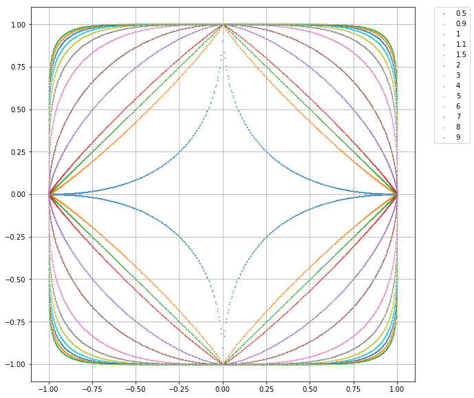

# CH03 k近邻法

[TOC]

## 前言

### 章节目录

1. k近邻算法
1. k近邻模型
   1. 模型
   1. 距离度量
   1. k值选择
   1. 分类决策规则
1. k近邻法的实现: KD树
   1. 构造KD树
   1. 搜索KD树

### 导读

kNN是一种基本分类与回归方法.

## k近邻算法
k=1的情形, 称为最近邻算法. 书中后面的分析都是按照最近邻做例子, 这样不用判断类别, 可以略去一些细节.

## k近邻模型

### 模型

### 距离度量

这里用到了$L_p$距离, 可以参考Wikipedia上$L_p$ Space词条(Refs[1])

1. p=1 对应 曼哈顿距离
1. p=2 对应 欧氏距离
1. 任意p 对应 闵可夫斯基距离

$$L_p(x_i, x_j)=\left(\sum_{l=1}^{n}{\left|x_{i}^{(l)}-x_{j}^{(l)}\right|^p}\right)^{\frac{1}{p}}$$

考虑二维的情况, 上图给出了不同的p值情况下与原点距离为1的点的图形. 这个图有几点理解下:

1. 与原点的距离
1. 与原点距离为1的点
1. 前一点换个表达方式, 图中的点向量($x_1$, $x_2$)的p范数都为1
1. 图中包含多条曲线, 关于p=1并没有对称关系

### k值选择
1. 关于k大小对预测结果的影响, 书中给的参考文献是ESL, 这本书还有个先导书叫ISL.
1. 通过交叉验证选取最优k
1. 二分类问题, k选择奇数有助于避免平票

### 分类决策规则
Majority Voting Rule

误分类率

$\frac{1}{k}\sum_{x_i\in N_k(x)}{I(y_i\ne c_i)}=1-\frac{1}{k}\sum_{x_i\in N_k(x)}{I(y_i= c_i)}$

如果分类损失函数是0-1损失, 误分类率最低即经验风险最小.

关于经验风险, 参考书上第一章 (1.11)和(1.16)

## 实现

### 构造kd树

### 搜索kd树

## Refs

1. [Lp Space](https://en.wikipedia.org/wiki/Lp_space)
2. ESL
