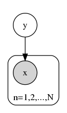

# CH04 朴素贝叶斯法

[TOC]

## 前言

### 章节目录

1. 朴素贝叶斯法的学习与分类
   1. 基本方法
   1. 后验概率最大化的含义
1. 朴素贝叶斯法的参数估计
   1. 极大似然估计
   1. 学习与分类算法
   1. 贝叶斯估计

### 导读

- 书中讲解的生成模型不多，生成模型学习联合概率分布，NB是典型的生成模型，与之对应的判别模型，是逻辑回归可以参考[CH06](../CH06/README.md)

- **0-1损失函数**时的期望风险最小化

- 给定数据集的时候，我们能知道不同类别的分布，这个很好统计的量叫**先验**$P(Y=c_k)$

  - 垃圾邮件识别可以用朴素贝叶斯的方法

- NB是常见的概率图模型之一[^4]。最简单的概率图模型，有向图。
  
  这个图中, y是输出变量,  x是输入变量, 是观测变量. 生成模型直接描述了输出以多大的概率生成输入.  在图模型里, **观测是灰色的, 变量是白色的**.

- 第一个参考文献[^1]，这里推荐阅读，链接中的手稿在2017年还有更新，开头部分介绍了很多符号的定义，可以配合[CH01](../CH01/README.md)的内容来理解。讲述了生成模型和判别模型，朴素贝叶斯和逻辑回归

- 另外在讲到CRF的时候，也有对比贝叶斯和逻辑回归，可以在[CH11](../CH11/README.md)的时候再回顾这里。

## 朴素贝叶斯法

### 参数数量

书中有这样一段内容

> 条件概率分布$P(X=x|Y=c_k)$有指数级数量的参数，其实际估计是不可行的。

上面这段有两点：

1. 指数级数量的参数
   这点书后面解释了，$K\prod_{j=1}^nS_j$，这个为什么是指数级数量，假设$S_j=S$，表达式变为$KS^n$，实际上在参考文献[^2]中有这个问题的讨论，里面用的是二值函数，可以参考理解

1. 实际估计是不可行的

   估计这么多参数需要更多的样本来刷参数，实际上获取这么多样本是不可行的。

### 算法推导

朴素贝叶斯法是基于**贝叶斯定理**与**特征条件独立假设**的分类方法.

- 贝叶斯定理
- 特征条件独立假设

#### 条件独立假设

求$P(Y|X)$，其中$X\in\{X_1,X_2,\dots,X_n\}$，条件独立假设这里给定$Y$的情况下：

1. 每一个$X_i$和其他的每个$X_k$是条件独立的
1. 每一个$X_i$和其他的每个$X_k$的子集是条件独立的

条件独立性假设是:
$$
\begin{align}
P(X=x|Y=c_k)&=P(X^{(1)},\dots,X^{(n)}|Y=c_k)\\
&=\prod^n_{j=1}P(X^{(j)}=x^{(j)}|Y=c_k)
\end{align}
$$
上面这个公式可能看起来不是太容易理解独立在哪里，这里引用一下文献[^2]中关于贝叶斯算法推导中的一部分
$$
\begin{aligned}
P(X|Y)&=P(X_1,X_2|Y)\\
&=\color{red}P(X_1|X_2,Y)\color{black}P(X_2|Y)\\
&=\color{red}P(X_1|Y)\color{black}P(X_2|Y)
\end{aligned}
$$
红色部分从上到下基于I.I.D.

条件独立假设等于是说用于分类的**特征**在**类确定**的条件下都是**条件独立**的.

## 参数估计

### 极大似然估计

> 为了估计状态变量的条件分布, 利用贝叶斯法则, 有
> $$
> \underbrace{P(X|Y)}_{posterior}=\frac{\overbrace{P(Y|X)}^{likelihood}\overbrace{P(X)}^{prior}}{\underbrace{P(Y)}_{evidence}}
> $$
> 其中$P(X|Y)$为后验概率(Posterior), $P(Y|X)$称为似然, $P(X)$称为先验(Prior)[^1].
>

- 后验概率最大化的含义

  朴素贝叶斯法将实例分到**后验概率最大的类**中, 这等价于**期望风险最小化**. 

### 贝叶斯估计

对于$x$的某个特征的取值没有在先验中出现的情况, 如果用极大似然估计, 这种情况的可能性就是0.
但是出现这种情况的原因通常是因为数据集不能全覆盖样本空间, 出现未知的情况处理的策略就是做平滑.
公式(4.10)对应了出现未知样本的情况下, 该给出一个什么样的值才合理的方案.
$$
P_{\lambda}(X^{(j)}=a_{jl}|Y=c_k)=\frac{\sum\limits_{i=1}^NI(x_i^{j}=a_{jl},y_j=c_k)+\lambda}{\sum\limits_{i=1}^NI(y_j=c_k)+S_j\lambda}
$$

其中$\lambda \geqslant 0$

当$\lambda = 0$的时候, 就是极大似然估计.

当$\lambda=1$的时候, 这个平滑方案叫做Laplace Smoothing. 拉普拉斯平滑相当于给未知变量给定了先验概率.

## 例子

### 例4.1

这个例子，有两个特征，一个标签，我们看看通过已知的数据表4.1能拿到哪些计算结果

1. 先验Prior，通过统计Y的数据分布可以知道

2. 不同$X$和$Y$的组合会产生多少参数，$X^{(1)}$可能的取值集合$A_1=\{1,2,3\}$大小为$S_1=3$，$X^{(2)}$可能的取值集合$A_2=\{S,M,L\}$大小为$S_2=3$，$Y\in C=\{1,-1\}$大小为$K=2$
   参数的数量为$KS_1S_2=18$，具体的空间的分布是一个$3\times 3\times2$的三维矩阵
2. 每个特征的增加，本来应该在原来的$Y，X$的基础上增加$S_i$倍的维度，但因为做了特征条件独立假设，增加的可能性，是base在给定的标签$Y$上的，也就是说实际上增加了$S_i$个取值
2. 这个题的解题过程可以考虑为：Groupby Y；Groupby Y，X1；Groupby Y，X2；对于新样本查表连乘。

### 例子4.2

## 扩展

### 树增强朴素贝叶斯

I.I.D. 强限制放宽，就是Tree Augmented Naive Bayes, TAN。可以看做是NB到贝叶斯网的过渡。

### 贝叶斯网

朴素贝叶斯法中假设输入变量都是条件独立的, 如果假设他们之间存在概率依存关系, 模型就变成了**贝叶斯网络**.

### LR与NB

逻辑斯谛回归与朴素贝叶斯的关系

这个在参考文献[^2]中有描述，另外在[CH06](../CH06/README.md)中也有说明如下：

> 逻辑斯谛回归与朴素贝叶斯模型的关系参见文献[4]

这里文献[4]和本章的参考文献[^2]同源，都是Mitchell TM的Machine Learning，现在依然是第一版，第二版的更新章节Tom有挂在网上[^3]

这里插一句Mitchell教授的介绍, CMU计算机学院院长，1997年创建自动化学习和探索中心，该中心是全球的高校中首个机器学习系，也是首个开设机器学习博士课程的机构。1997-2016，Mitchell是该中心负责人。

这些都还OK，主要是Mitchell教授加入了松鼠AI。

## 参考

1. [^1]: [视觉SLAM十四讲, 高翔](## 参考)

2. [^2]: [Generative and discriminative classifiers: Naive Bayes and logistic regression](http://www.cs.cmu.edu/~tom/mlbook/NBayeslogReg.pdf)

3. [^3]: [Machine Learning New Chapter](http://www.cs.cmu.edu/~tom/NewChapters.html)

4. [^4 ]: [An Introduction to Conditional Random Fields for Relational Learning](-)

**[⬆ top](#导读)**