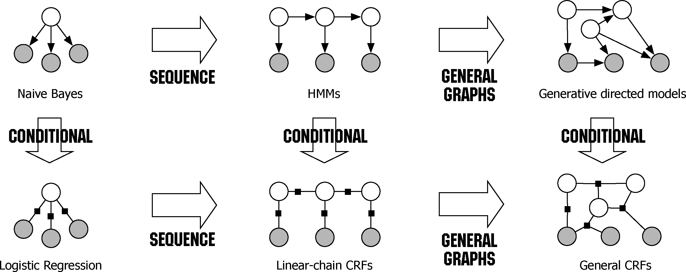

# CH11 条件随机场

[TOC]

## 前言

本章目录结构如下:

1. 概率无向图模型
   1. 模型定义
   1. 概率无向图的**因子分解**
1. 条件随机场的定义与形式
   1. 条件随机场的定义
   1. 条件随机场的**参数化形式**
   1. 条件随机场的**简化形式**
   1. 条件随机场的**矩阵形式**
1. 条件随机场的概率计算问题
   1. 前向-后向算法
   1. 概率计算
   1. 期望值计算
1. 条件随机场的学习方法
   1. 改进的迭代尺度法
   1. 拟牛顿法
1. 条件随机场的预测算法

整个这一章的介绍思路, 和前一章有点像, 尤其是学习算法部分. 和HMM比主要增加了特征函数.

## 概念

### 符号表

节点$\nu\in V$表示一个随机变量$Y_{\nu}$

边$e\in E$表示随机变量之间的概率依赖关系

图$G(V,E)$表示联合概率分布$P(Y)$

$Y\in \mathcal Y$是**一组随机变量**$Y=(Y_{\nu})_{\nu \in V}$

### IOB标记

**I**nside, **O**utside, **B**egin

### 概率无向图模型

又称马尔可夫随机场, 是一个可以由无向图表示的联合概率分布.

马尔可夫随机场

成对马尔可夫性

局部马尔可夫性

全局马尔可夫性

概率无向图模型的最大特点就是易于因子分解.

条件随机场是给定随机变量X条件下, 随机变量Y的马尔可夫随机场.

### 特征函数

线性链条件随机场的参数化形式
$$
P(y|x)=\frac{1}{Z(x)}\exp\left(\sum\limits_{i,k}\lambda_kt_k(y_{i-1},y_i,x,i)+\sum_{i,l}\mu_ls_l(y_i,x,i)\right)
$$
其中

$t_k$是定义在边上的特征函数, 称为转移特征

$s_l$是定义在结点上的特征函数, 称为状态特征.

### 对数线性模型

线性链条件随机场也是**对数线性模型**(定义在时序数据上的).

条件随机场可以看做是最大熵马尔可夫模型在标注问题上的推广.

条件随机场是计算联合概率分布的有效模型.

## 例子

### 例11.1

特征函数部分的内容理解下.

### 例11.2

### 例11.3

## CRF与LR比较

引用个图[^1]

来自Sutton, Charles, and Andrew McCallum. "[An introduction to conditional random fields](http://homepages.inf.ed.ac.uk/csutton/publications/crftut-fnt.pdf)." Machine Learning 4.4 (2011): 267-373.

上面一行是生成模型, 下面一行是对应的判别模型.

## 应用

最后这两章的HMM和CRF真的是NLP方面有深入应用. HanLP的代码中有很多具体的实现. 

## 习题

## 参考

1. [^1]: [An Introduction to conditional random fields](http://homepages.inf.ed.ac.uk/csutton/publications/crftut-fnt.pdf)

1. [^2]: [HanLp](http://hanlp.com/)