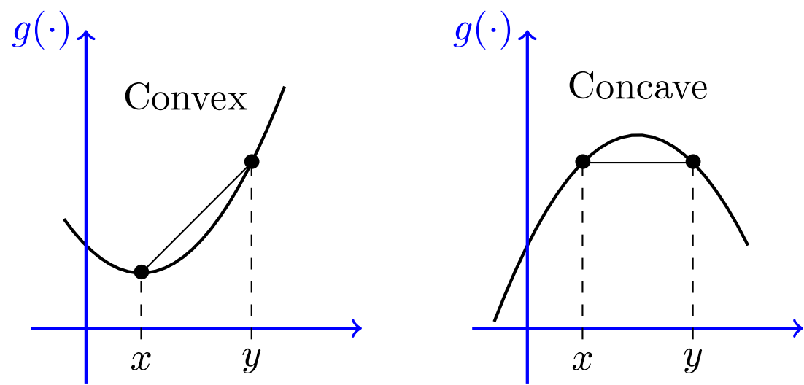
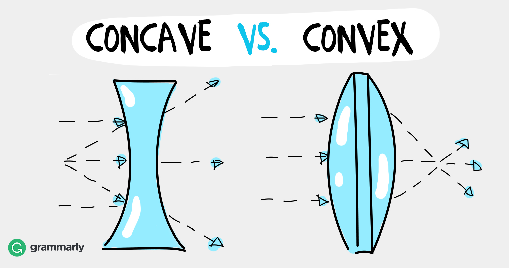

# 参考文献

## 前言

这个文档的初衷是记录书中引用文献的链接， 但是后来这个被[Downloader](../ref_downloader.sh)做了， 可以自动下载所有文献到refs文件夹。

在review02的时候，发现书中的文献有些可圈点，或精读，或略读，或以后再读，都需要个文档来记录，就在这个文档的基础上做这个事情吧。

本文中的文献不限于《统计学习方法》中引用的范围， 扩充的一些会有一定的说明。

## CH01 统计学习方法概论

1. 0
1. 0
1. Bishop, 2006 PRML 这本书火的不得了
1. Brian, 1996 PRNN 这本书早发十年, 不火. 居然早发了十年, 只有英文版本, 没有中文翻译. 

## CH04 朴素贝叶斯法

1. [Mitchell TM, 2017](http://www.cs.cmu.edu/~tom/mlbook/NBayesLogReg.pdf)
   这是机器学习第二版的手稿，这部分讲的内容很经典，推荐阅读。在Refs里面做了[翻译笔记](r_0401.md)
1. ESL
   书中说的是关于朴素贝叶斯法的介绍，这本书中有描述，但是，暂时没找到。后面再详细看。
1. 

## CH06 逻辑斯谛回归与最大熵模型

1. [Berger, 1996](http://www.cs.cornell.edu/courses/cs5740/2016sp/resources/maxent.pdf)

   书中6.1的例子来自这里， 文章讲述的是Maxent在NLP里面的应用， 例子给出的是法语到英语的翻译。 

   在文献中, 还包含了Feature Selection部分, 在书中并没有对应的体现, 可以细看一下.

## CH08 提升方法

## CH09 EM算法及其推广

1. [Dempster, 1977](http://web.mit.edu/6.435/www/Dempster77.pdf)
   maximum-likelihood from **incomplete data** via the em algorithm
   不完全数据
1. 

## CH10 隐马尔可夫模型

1. [Rabiner, 1986](https://www.cs.umb.edu/~rvetro/vetroBioComp/HMM/Rabiner1986%20An%20Introduction%20to%20Hidden%20Markov%20Models.pdf)
   本书HMM部分的符号体系和这个文章是一样的, 参考文件的第一二文章和第九章的最大熵的文章差不多, 经典. 文章较长, 讨论的较全面.

## 其他

1. Zhangtong, 2001, Statistical Behavior and Consistency of Classification Methods based on Convex Risk Minimization

   文章中有AdaBoost和LR的损失函数对比，从凸风险最小化的角度来分析这些算法。和CH06，CH07,CH08都有关系。文章中损失函数用$\phi$表示。

   从距离的角度看， 逻辑回归的度量函数是KL散度，也就是相对熵。

   在定义Bregman Divergence的时候，文献中提到了convex和concave，下面引用两个图片。

   

   图片来自， https://math.stackexchange.com/questions/2364116/how-to-remember-which-function-is-concave-and-which-one-is-convex

   

   图片来自https://www.grammarly.com/blog/concave-vs-convex/

   Bregman Divergence 非负。

1. 